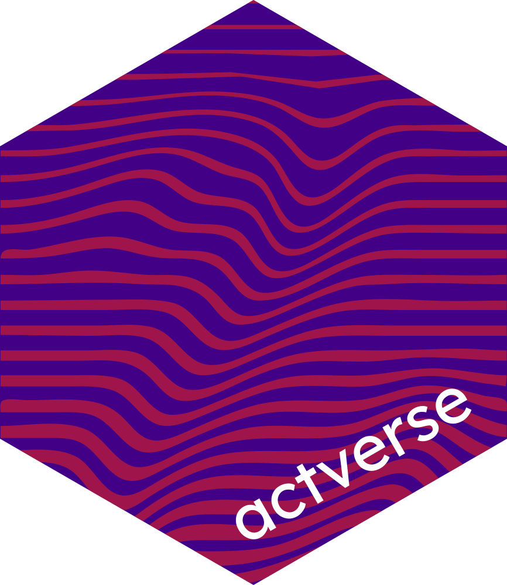
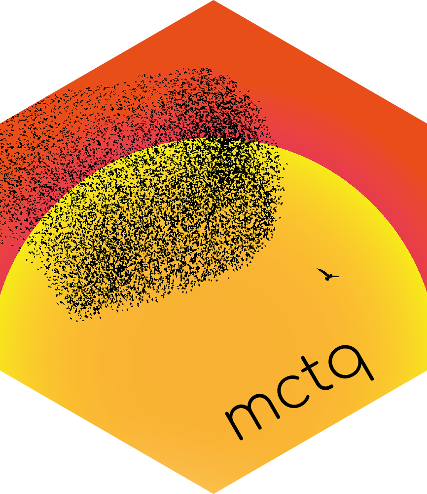

<!-- See <https://pagedown.rbind.io/#resume> to learn more. -->

```{r, include=FALSE}
knitr::opts_chunk$set(
  results = "asis",
  echo = FALSE
)
```

```{r, eval=FALSE, include=FALSE}
library(beepr)
library(checkmate)
library(datadrivencv)
library(dplyr)
library(glue)
library(googlesheets4)
library(here)
library(metathis)
library(pagedown)
library(purrr)
library(rmarkdown)
library(tidyr)
library(withr)
```

```{r, include=FALSE}
source(here::here("R", "printing.R"))
```

```{r metathis, echo = FALSE, message = FALSE, warning = FALSE}
metathis::meta() |>
  metathis::meta_name("github-repo" = "danielvartan/cv-en") |>
  metathis::meta_social(
    title = "Daniel Vartanian's CV",
    url = "https://danielvartan.github.io/cv-en",
    og_type = "website",
    og_author = "Daniel Vartanian",
    og_locale = "en_US"
  )
```

<!-- styles: start -->
<link rel="stylesheet" href="https://cdn.jsdelivr.net/gh/jpswalsh/academicons@1/css/academicons.min.css">
<!-- styles: end -->

<!-- scripts: start -->
<script src="https://kit.fontawesome.com/ddcb976bc4.js" crossorigin="anonymous"></script>
<!-- scripts: end -->

```{r, include = FALSE}
data_location <- paste0(
  "https://docs.google.com/spreadsheets/d/",
  "1hO0W-flSkoZkp69t2k6fvwMeNLqrnslnmpOKgjpNePI"
)

# Read all data and initialize a cv printer object
cv <- data_location  |> create_cv_object()
```

# Aside

{width=100% style='border-radius: 50%; text-align: center;'}

```{r}
if (isTRUE(params$pdf_mode)) {
  cat(
    "<p style='font-size: 0.7rem; text-align: center;'>",
    "Access this CV online at: ",
    "[danielvartan.github.io/cv-en]",
    "(https://danielvartan.github.io/cv-en)",
    "</p>",
    sep = ""
  )
} else {
  cat(
    "<p style='text-align: center;'>",
    "[<i class = 'fas fa-download'></i> Download this CV]",
    "(pdf/Daniel%20Vartanian.pdf)",
    "</p>",
    sep = ""
  )
}
```

::: {style="text-align: left; padding-top:20px;"}
<h2>Contact</h2>

<i class="fa fa-map-marker"></i>  São Paulo, SP, Brazil

<i class="fa-solid fa-phone"></i> [+55 11 95057-9817](https://wa.me/+5511950579817)

<i class="fa-solid fa-envelope"></i> [danvartan@gmail.com](mailto:danvartan@gmail.com)

<i class="fa-brands fa-github"></i> [danielvartan](https://github.com/danielvartan)

<i class="fa-brands fa-linkedin-in"></i> [danielvartan](https://www.linkedin.com/in/danielvartan)

<i class="fa-brands fa-orcid"></i> [0000-0001-7782-759X](https://orcid.org/0000-0001-7782-759X)
:::

::: {style="text-align: left; padding-top:20px;"}
<h2>References</h2>

<h3 style="padding-top: 15px;">[Prof. Dr. Aline Carvalho](https://orcid.org/0000-0002-4900-5609)</h3>

<p>
Department of Nutrition<br>
School of Public Health<br>
University of São Paulo
</p>

<h3>[Prof. Dr. Camilo R. Neto](https://orcid.org/0000-0001-6783-6695)</h3>

<p>
Graduate Program in Complex Systems Modeling<br>
School of Arts, Sciences and Humanities<br>
University of São Paulo
</p>

<h3>[Prof. Dr. Leandro Garcia](https://orcid.org/0000-0001-5947-2617)</h3>

<p>
Senior Lecturer in Complexity Science in Public Health<br>
Centre for Public Health<br>
Queen's University Belfast
</p>
:::

## Disclaimer {#disclaimer}

Developed with R [pagedown](https://github.com/rstudio/pagedown) and [datadrivencv](https://github.com/nstrayer/datadrivencv) packages

Source code available at [github.com/danielvartan/cv-en](https://github.com/danielvartan/cv-en)

Last updated on `r withr::with_locale(c("LC_TIME" = "en_US"), format(Sys.Date(), "%B %e, %Y"))`

# Main

## Daniel Vartanian {#title}

<p style="font-size: 0.7rem;">Interdisciplinary researcher with a primary focus on agent-based modeling, complex systems, and research software engineering in social, public health, and environmental contexts. Highly skilled in R (including package development), NetLogo, Python, and modern data visualization platforms. Developed and maintained peer-reviewed software and pipelines for academic and applied research, including several R packages distributed via CRAN and models for international collaborative studies.<p>

<p style="font-size: 0.7rem;">Extensive experience in managing research projects, grant and proposal writing (Brazilian national agencies, institutional calls), training and mentoring early-career researchers, and delivering scientific communication to both technical and non-technical audiences. Demonstrated ability to work independently and in multicultural, cross-disciplinary teams, including collaborations with international open science initiatives and public sector partners. Committed to reproducible research practices, scientific integrity, and impactful research to address complex societal challenges. Fluent in English and Portuguese, and prepared to relocate and adapt to international academic environments.<p>

<p style="font-size: 0.7rem; font-style: italic; color: #4F5556;">Additional supporting documents, detailed outputs, and original references available upon request or via links below.<p>

<p style="font-size: 0.7rem; font-style: italic; color: #4F5556;">Legal name: Daniel Kachvartanian de Azevedo<br>Professional and social name: Daniel Vartanian<p>

## Education {#education data-icon=graduation-cap}

```{r}
cv <- cv |> print_section("education")
```

## Research Experience {#research data-icon=laptop}

```{r}
cv <- cv |> print_section("research_experience")
```

::: {.aside style="top: 0px;"}
<h2>Languages</h2>

<p style="margin-top: 5px"><i class="fa-solid fa-crow"></i> [danielvartan](https://www.duolingo.com/profile/danielvartan)</p>

<h3 style="padding-top: 10px">English</h3>

<i class="fa-solid fa-ear-listen"></i> Fluent

<i class="fas fa-book-reader"></i> Fluent

<i class="fa fa-comments-o" aria-hidden="true"></i> Fluent

<i class="fas fa-pencil-alt" aria-hidden="true"></i> Fluent

<h3 style="padding-top: 10px">Portuguese</h3>

<i class="fa-solid fa-ear-listen"></i> Fluent

<i class="fas fa-book-reader"></i> Fluent

<i class="fa fa-comments-o" aria-hidden="true"></i> Fluent

<i class="fas fa-pencil-alt" aria-hidden="true"></i> Fluent

<h3 style="padding-top: 10px">Spanish</h3>

<i class="fa-solid fa-ear-listen"></i> Fluent

<i class="fas fa-book-reader"></i> Fluent

<i class="fa fa-comments-o" aria-hidden="true"></i> Intermediate

<i class="fas fa-pencil-alt" aria-hidden="true"></i> Intermediate

<h3 style="padding-top: 10px">French</h3>

<i class="fa-solid fa-ear-listen"></i> Basic

<i class="fas fa-book-reader"></i> Basic

<i class="fa fa-comments-o" aria-hidden="true"></i> Basic

<i class="fas fa-pencil-alt" aria-hidden="true"></i> Basic
:::

## Teaching Experience {#teaching data-icon=chalkboard-user}

```{r}
cv <- cv |> print_section("teaching_experience")
```

::: {.aside style="top: 0px;"}
<h2>Programming Languages</h2>

<p style="margin-top: 5px"><i class="fa-brands fa-github"></i> [danielvartan](https://github.com/danielvartan)</p>

<h3 style="padding-top: 10px">Expert</h3>

<i class="fab fa-r-project"></i> `R`

<i class="fa-solid fa-map"></i> `NetLogo`

<h3 style="padding-top: 10px">Advanced</h3>

<i class="fab fa-python"></i> `Python`

<i class="fas fa-database"></i> `SQL`

<h3 style="padding-top: 10px">Intermediate</h3>

<i class="fa-solid fa-terminal"></i> `Bash`

<i class="fab fa-js"></i> `JavaScript`

<h3 style="padding-top: 10px">Beginner</h3>

<i class="fa-solid fa-code"></i> `C` `C++` `C#`

<i class="fa-solid fa-code"></i> `Scala`

<i class="fa-solid fa-code"></i> `GAML` (GAMA)

<i class="fa-solid fa-robot"></i> `GDScript` (Godot)

<i class="fa-solid fa-code"></i> `Julia`

<i class="fa-solid fa-code"></i> `Lua`

<i class="fa-brands fa-php"></i> `PHP`

<h3 style="padding-top: 10px">Markup/Other Languages</h3>

<i class="fab fa-css3-alt"></i> `CSS`

<i class="fas fa-code-branch"></i> `Git`

<i class="fab fa-html5"></i> `HTML`

<i class="fa-brands fa-markdown"></i> `Markdown`

<i class="fa-brands fa-sass"></i> `SASS`

<i class="fas fa-code"></i> `SPSS`

<i class="fa-solid fa-code"></i> `TeX` `LaTeX`
:::

## Affiliations {#affiliations data-icon=id-badge}

```{r}
cv <- cv |> print_section("affiliations")
```

<!-- \pagebreak -->

## Additional Training {#training data-icon=book-open-reader}

```{r}
cv <- cv |> print_section("additional_training")
```

::: {.aside style="top: 0px;"}
<h2>Technical Skills</h2>

<p style="margin-block-start: 0em;">Statistical modeling</p>

<p style="margin-block-start: 0em;">Complex systems modeling</p>

<p style="margin-block-start: 0em;">Agent-based modeling</p>

<p style="margin-block-start: 0em;">Dynamical systems modeling</p>

<p style="margin-block-start: 0em;">Complex network analysis</p>

<p style="margin-block-start: 0em;">Machine learning</p>

<p style="margin-block-start: 0em;">Temporal data analysis</p>

<p style="margin-block-start: 0em;">Spatial data analysis</p>

<p style="margin-block-start: 0em;">Research software development</p>

<p style="margin-block-start: 0em;">R package development</p>

<p style="margin-block-start: 0em;">Python library development</p>

<p style="margin-block-start: 0em;">Data science and engineering</p>

<p style="margin-block-start: 0em;">Data visualization</p>

<p style="margin-block-start: 0em;">[Shiny](https://shiny.posit.co/) Dashboards</p>

<p style="margin-block-start: 0em;">Open science practices</p>

<p style="margin-block-start: 0em;">Reproducible research</p>

<p style="margin-block-start: 0em;">Technical and academic writing</p>

<p style="margin-block-start: 0em;">Proposal/grant writing</p>

<p style="margin-block-start: 0em;">Community building and management</p>

<p style="margin-block-start: 0em;">Graphic design</p>

<p style="margin-block-start: 0em;">Web design</p>
:::

## Honors, Awards & Fellowships {#funding data-icon=medal}

```{r}
cv <- cv |> print_section("funding")
```

## Outreach Projects {#outreach data-icon=users}

```{r}
cv <- cv |> print_section("outreach")
```

## Selected Talks {#talks data-icon=comments}

```{r}
cv <- cv |> print_section("talks")
```

::: {.aside style="top: 0px;"}
<h2>R Packages</h2>

<a href="https://danielvartan.github.io/actverse/"></a>

<a href="https://danielvartan.github.io/brandr/"></a>

<a href="https://danielvartan.github.io/groomr/"></a>

<a href="https://danielvartan.github.io/orbis/"></a>

<a href="https://danielvartan.github.io/quartor/"></a>

<a href="https://docs.ropensci.org/mctq/"></a>
:::

## Software Projects {#software data-icon=box-open}

```{r}
cv <- cv |> print_section("software_development")
```

::: {.aside style="top: 0px;"}
<h2>Educational Materials</h2>

<h3 style="padding-bottom: 1rem;">[Introductory R Course](https://danielvartan.github.io/r-course/)</h3>

<h3 style="padding-bottom: 1rem;">[ODD Protocol Template](https://github.com/danielvartan/odd-protocol-template)</h3>

<h3 style="padding-bottom: 1rem;">[Quarto Format for ABNT Theses and Dissertations](https://github.com/danielvartan/abnt)</h3>

<h3 style="padding-bottom: 1rem;">[Railsback & Grimm (2019) Business Investor Model ABM](https://github.com/danielvartan/business-investor-model)</h3>

<h3 style="padding-bottom: 1rem;">[Illustration of the Lorenz System](https://danielvartan.github.io/lorenz-system/)</h3>

<h3 style="padding-bottom: 1rem;">[Illustration of the SIR Model](https://danielvartan.github.io/sir/)</h3>

<h3 style="padding-bottom: 1rem;">[Illustration of Lotka-Volterra's Predator-Prey Model](https://danielvartan.github.io/lotka-volterra/)</h3>

<h3 style="padding-bottom: 1rem;">[Illustration of the Bootstrap Method](https://danielvartan.github.io/bootstrap/)</h3>

<h3 style="padding-bottom: 1rem;">[Illustration of General Linear Models Using Penguins](https://danielvartan.github.io/linear-models/)</h3>

<h3 style="padding-bottom: 1rem;">[Illustration of the Central Limit Theorem & the Law of Large Numbers](https://danielvartan.github.io/central-limit-theorem/)</h3>

<h3 style="padding-bottom: 1rem;">[Illustration of Fisher's Hypothesis in Brazil's Economy](https://danielvartan.github.io/fisher-hypothesis/)</h3>
:::

## Academic Publications & Posters {#publications data-icon=book}

```{r}
cv <- cv |> print_section("publications")
```

## Academic Events Attended {#events data-icon=calendar-check}

```{r}
cv <- cv |> print_section("events")
```
